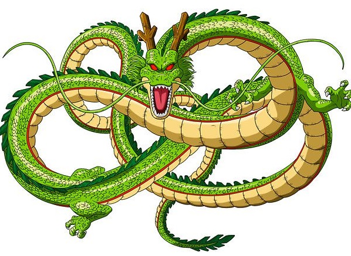

# Dragon Ball Super Card Game Maker

## Description

I play the Dragon Ball Super Card Game TCG with some friends. We enjoyed making our own silly cards but it was a pain to make them in Paint, so I decided to make something specialized. With this website you can easily create your own Dragon Ball TCG cards.

I am completely unafiliated with Akira Toriyama, DragonBall, Bandai, etc. etc. Please do not try to use this software to make counterfeit cards to trade to kids. First, that's cruel. Second, I do not have the fonts anywhere close to accurate enough. Just don't. This is meant to be for fun only.  

## Site

You can see the live site at [shenwrong.com](http:shenwrong.com/).

The name is supposed to be a pun on the dragon Shenlong and "wrong" because the cards are fake. Idk, I'm not very funny. 

## Screenshot 

Here's a screenshot of the site being used to turn a classic Yu-Gi-Oh Egyptian God into a broken Dragon Ball card. 

## Local Development

This project was generated with [Angular CLI](https://github.com/angular/angular-cli) version 8.3.8.

To get this up and running locally:

  `git clone https://github.com/amandagrice/dbscg-maker`
  
  `cd dbscg-maker`
  
  `npm install`
  
  `ng serve`
  
Then navigate to `http://localhost:4200/`. 

The app will automatically reload if you change any of the source files.

## To-Do List:

### Major Features:
- Add ability to create leader cards.
- Add ability to create extra cards.
- Add dual-colored cards.

### Minor Tweaks:
- Make the last three digits of power smaller to match real cards.
- Fix card text font to match real cards better.
- Add ability to remove all auto-highlighting in case it screws up.
- Find a way to auto highlight numbers for skills that have costs in the name. (ex. sparking, over realm)
- Add ability to add costs to card text from the UI instead of typing codes. 

## Can I help?

Sure! Shoot me an email. algrice@bu.edu :)
